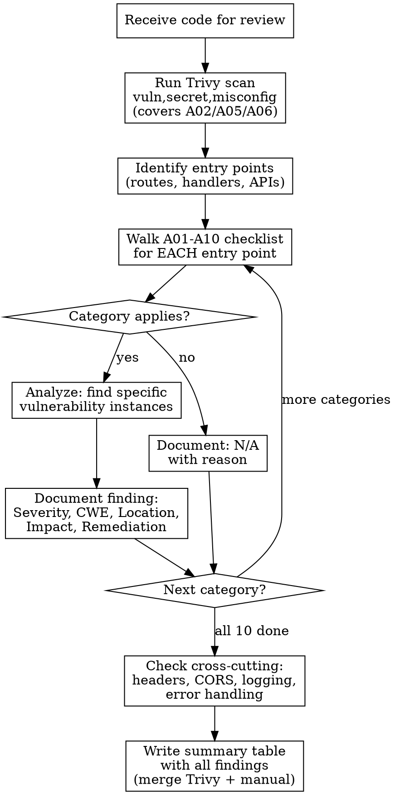

# Security Analysis

## Overview

Systematic security code review using OWASP Top 10 (2021) as a checklist. The core principle: **scan every OWASP category explicitly, not just the vulnerabilities that jump out at you.**

Ad-hoc reviews miss categories. This skill enforces a structured pass through all 10 OWASP categories, maps findings to CWE identifiers, and produces actionable remediation with consistent severity scoring.

## When to Use

- Reviewing code (PRs, files, modules) for security vulnerabilities
- Performing security audits or pre-audit preparation
- Assessing application security posture
- Answering "is this code secure?" questions
- Preparing for penetration tests
- Reviewing after a security incident

**When NOT to use:**
- Pure performance reviews (no security angle)
- UI/UX reviews without data handling
- Infrastructure/network security (this is application-layer focused)

## Trivy Automated Scanning

Run **Trivy** before the manual OWASP checklist to automate detection of vulnerable dependencies (A06), hardcoded secrets (A02), and misconfigurations (A05).

### Trivy Usage

**Preferred — direct CLI (if installed):**
```bash
trivy fs --scanners vuln,secret,misconfig /path/to/project
```

**Fallback — Docker:**
```bash
docker run --rm -v $PWD:/myapp aquasec/trivy:latest fs --scanners vuln,secret,misconfig /myapp
```

**Individual scanners** (when only one category is relevant):
```bash
trivy fs --scanners vuln /path/to/project        # A06: dependency CVEs
trivy fs --scanners secret /path/to/project       # A02: hardcoded secrets
trivy fs --scanners misconfig /path/to/project    # A05: misconfigurations
```

### OWASP Category Mapping

| Trivy Scanner | OWASP Category | What It Finds |
|---------------|----------------|---------------|
| `vuln` | **A06** - Vulnerable Components | Known CVEs in dependencies |
| `secret` | **A02** - Cryptographic Failures | Hardcoded API keys, passwords, tokens, private keys |
| `misconfig` | **A05** - Security Misconfiguration | IaC misconfigs (Dockerfile, Kubernetes, Terraform, etc.) |

### Integrating Trivy Output

1. Run Trivy with all three scanners **before** starting the OWASP checklist
2. Map each finding to its OWASP category (see table above)
3. Include CVE IDs, severity, and affected package/file from Trivy in the report
4. For each Trivy finding, add a row to the summary table
5. Mark A02, A05, A06 as covered by Trivy — still do manual review for issues Trivy cannot detect (e.g., logic-level crypto misuse for A02, application-level misconfig for A05)

**Do NOT use WebSearch for known CVE lookups when Trivy is available.** Trivy's offline DB is faster and more reliable.

## The OWASP Checklist Method

**Do NOT rely on pattern-matching alone.** Walk through each category explicitly, even if you think it doesn't apply. Document "N/A - not applicable because [reason]" for categories that genuinely don't apply.

### Category Scan Order

For each piece of code, check ALL 10 categories in order:

| # | Category | What to Look For |
|---|----------|-----------------|
| **A01** | Broken Access Control | Missing authz checks, IDOR, privilege escalation, CORS misconfiguration, path traversal, forced browsing |
| **A02** | Cryptographic Failures | **Trivy `secret` scanner** detects hardcoded keys/tokens. Also check: weak hashing (MD5/SHA1 for passwords), missing TLS, weak random, missing encryption at rest |
| **A03** | Injection | SQL injection (string interpolation in queries), XSS (unescaped output), command injection (shell=True, os.system), LDAP injection, template injection (SSTI) |
| **A04** | Insecure Design | Missing rate limiting, no threat modeling, missing abuse case handling, no defense in depth, business logic flaws |
| **A05** | Security Misconfiguration | **Trivy `misconfig` scanner** detects IaC issues (Dockerfile, K8s, Terraform). Also check: debug mode in production, default credentials, unnecessary features enabled, missing security headers, verbose error messages, XML external entities (XXE) |
| **A06** | Vulnerable Components | **Use Trivy** for dependency scanning (see above). Outdated dependencies, known CVEs in packages, unmaintained libraries. Note: misusing a library's API (e.g., `yaml.load` without SafeLoader) is A08, not A06. A06 is about the dependency *version* having known vulnerabilities |
| **A07** | Auth Failures | Weak password policy, missing MFA, session fixation, JWT without expiry, credential stuffing susceptibility, brute force susceptibility |
| **A08** | Integrity Failures | Insecure deserialization (pickle, yaml.load), unsigned updates, CI/CD pipeline injection, missing integrity verification |
| **A09** | Logging Failures | No security event logging, sensitive data in logs, no alerting, no audit trail, missing monitoring |
| **A10** | SSRF | Unvalidated URL fetches, internal service access via user input, cloud metadata endpoint access |

### Structured Output Format

For each finding, provide:

```
### [SEVERITY] A0X: Short Description
- **Category:** A0X - Category Name
- **CWE:** CWE-XXX (Name)
- **Location:** file:line_number
- **Impact:** What an attacker can achieve
- **Remediation:** Specific code fix (not generic advice)
```

### Severity Scoring

Use this consistent scale:

| Severity | Criteria | Examples |
|----------|----------|---------|
| **CRITICAL** | Remote code execution, full DB access, authentication bypass | SQL injection, command injection, pickle deserialization, hardcoded admin credentials |
| **HIGH** | Data breach, privilege escalation, significant data exposure | IDOR, path traversal to sensitive files, missing authz on admin routes, SSRF to internal services |
| **MEDIUM** | Limited data exposure, denial of service, security weakening | Missing security headers, JWT without expiry, verbose errors, weak hashing |
| **LOW** | Defense-in-depth gaps, minor information disclosure | Missing rate limiting, debug info exposure in non-prod, missing CSRF tokens on non-sensitive forms |

## Common CWE Reference

Quick lookup for the most common findings:

| Vulnerability | CWE | OWASP |
|--------------|-----|-------|
| SQL Injection | CWE-89 | A03 |
| XSS (Reflected) | CWE-79 | A03 |
| XSS (Stored) | CWE-79 | A03 |
| Command Injection | CWE-78 | A03 |
| SSTI | CWE-1336 | A03 |
| Path Traversal | CWE-22 | A01 |
| IDOR | CWE-639 | A01 |
| Missing Authz | CWE-862 | A01 |
| CSRF | CWE-352 | A01 |
| Hardcoded Credentials | CWE-798 | A02 |
| Weak Hash (passwords) | CWE-328 | A02 |
| Cleartext Transmission | CWE-319 | A02 |
| Insecure Deserialization | CWE-502 | A08 |
| SSRF | CWE-918 | A10 |
| Open Redirect | CWE-601 | A01 |
| XXE | CWE-611 | A05 |
| Unsafe YAML Load | CWE-502 | A08 |
| Missing Rate Limit | CWE-770 | A04 |
| Debug Mode in Prod | CWE-489 | A05 |
| Sensitive Data in Logs | CWE-532 | A09 |

## Review Process



## Red Flags - STOP and Reconsider

If you catch yourself doing any of these, you are cutting corners:

- **Skipping categories** because "they probably don't apply" - check ALL 10
- **Accepting "it's internal/VPN-only"** as a reason to skip findings - internal tools get compromised via lateral movement, compromised laptops, supply chain attacks
- **Accepting "we'll harden it later"** - document the finding now with full severity
- **Listing issues without CWE references** - every finding should have a CWE
- **Giving generic remediation** like "validate input" - provide specific code fixes
- **Only finding injection** - injection is obvious; access control, crypto, and logging issues are what get missed
- **Stopping after finding 3-5 issues** - continue through ALL categories
- **Reducing severity because of deployment context** - a CRITICAL SQL injection is CRITICAL whether it's on the public internet or behind a VPN

## Common Mistakes

**Only finding the obvious:** Injection jumps out. Access control, insecure design, logging failures, and integrity issues get systematically missed. The checklist prevents this.

**"It's just internal":** Every internal tool is one VPN credential leak, one compromised laptop, or one misconfigured firewall rule away from being external. Review internal code with the same rigor.

**Generic remediation:** "Use parameterized queries" is not enough. Show the parameterized version of the actual vulnerable code. "Validate input" is not actionable. Show what validation looks like for that specific input.

**Missing cross-cutting concerns:** Security headers (CSP, HSTS, X-Frame-Options), CORS configuration, error handling (stack traces in responses), and rate limiting are not endpoint-specific. Check them separately after the per-endpoint scan.

**Double-counting findings:** Each vulnerability belongs to ONE primary OWASP category. If `yaml.load()` without SafeLoader appears, classify it under A08 (Integrity Failures - insecure deserialization), not both A06 and A08. Choose the most specific category.

## Summary Table Template

End every security review with a summary:

```markdown
| # | Severity | OWASP | CWE | Finding | Location |
|---|----------|-------|-----|---------|----------|
| 1 | CRITICAL | A03   | CWE-89  | SQL injection in login | auth.js:15 |
| 2 | HIGH     | A01   | CWE-862 | Missing admin authz   | admin.js:* |
| ... | ... | ... | ... | ... | ... |

**Categories checked:** A01-A10
**Categories with findings:** A01, A03, A05, A07
**Categories N/A:** A10 (no URL fetching)
**Categories scanned by Trivy:** A02 (secrets), A05 (misconfig), A06 (vuln)
**Categories clear:** A02, A04, A08, A09
```

This ensures reviewers can verify all 10 categories were examined.
