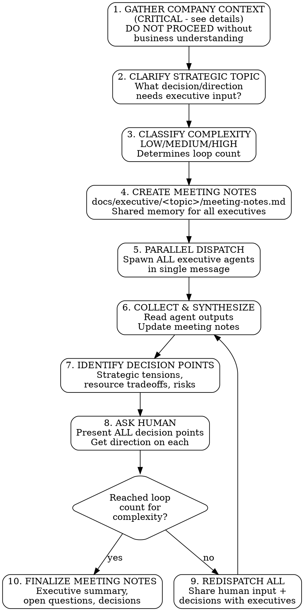

# Executive Discussion Forum

## Overview

Multi-agent strategic forum for C-suite discussions. Dispatches parallel executive agents (CEO, CPO, CTO, COO, CRO, CMO, CCO), maintains shared meeting notes, runs discussion loops with human input on all strategic decisions.

**Core principle:** Company context is ESSENTIAL. Without understanding the business, agents give generic advice. Ask FIRST, dispatch SECOND.

**Who runs this skill:** Only the main thread (meeting owner) can execute this workflow. If you are a subagent, report back to the main thread.

## The Process



## Step 1: Gather Company Context (CRITICAL)

**DO NOT DISPATCH EXECUTIVES WITHOUT THIS CONTEXT.**

Generic strategic advice is worthless. You MUST understand the business before any agent can give relevant guidance.

### Required Context Categories

| Category | Questions to Ask |
|----------|------------------|
| **Company basics** | What does the company do? Stage (seed/growth/mature)? Revenue scale? |
| **Market position** | Who are competitors? What's the differentiation? Market share? |
| **Current strategy** | What's the current strategic direction? Recent pivots? |
| **Team & resources** | Team size? Key constraints? Budget situation? |
| **Challenges** | What's not working? Pain points? Urgent issues? |
| **Goals** | 1-year goals? 3-year vision? Success metrics? |

### Context Sources

Check these BEFORE asking the human:

1. **CLAUDE.md or similar** - May contain company context
2. **README.md** - May describe the business
3. **docs/ folder** - May have strategy docs, business plans
4. **Previous meeting notes** - May have established context

If context exists in files, confirm with human: "I found [X] about the company. Is this current?"

### When to Move to Step 2

Only proceed when you can answer:
- [ ] I know what the company does and its market position
- [ ] I understand current strategic direction
- [ ] I know key constraints (resources, timeline, budget)
- [ ] I understand the specific challenge/opportunity being discussed
- [ ] I have confirmed my understanding with the human

---

## Step 2: Clarify Strategic Topic

After gathering company context, clarify what strategic question needs executive input:

- What decision needs to be made?
- What alternatives are being considered?
- What's the urgency/timeline?
- Who are the stakeholders affected?
- What constraints apply?

---

## Step 3: Classify Complexity (DETERMINES LOOP COUNT)

After clarification, classify the strategic topic's complexity. This determines how many discussion loops you MUST run.

### Complexity Levels

| Level | Loop Count | Criteria |
|-------|------------|----------|
| **LOW** | 3 loops | Single domain, clear decision, minimal cross-functional impact |
| **MEDIUM** | 5 loops | Cross-functional, some ambiguity, multiple stakeholder groups |
| **HIGH** | 7 loops | Company-wide, novel territory, regulatory/compliance, significant risk |

### Classification Checklist

**Mark as HIGH if ANY of these apply:**
- Involves regulatory/compliance requirements
- Requires significant organizational restructuring
- Affects 3+ business functions significantly
- Involves M&A, major partnerships, or market entry/exit
- Has board-level visibility or investor implications
- Novel strategic territory with high uncertainty

**Mark as MEDIUM if ANY of these apply (and not HIGH):**
- Crosses 2+ executive domains
- Requires evaluating new business models or markets
- Has dependencies on external partners or vendors
- Involves significant budget reallocation
- Affects customer-facing operations materially

**Mark as LOW only if:**
- Single domain, single executive primarily affected
- Well-understood decision with clear options
- Standard operational decision
- Low risk, reversible if wrong

**When in doubt, classify UP.** Better to have more discussion than miss critical issues.

### Document Classification

In meeting notes, record:
```markdown
## Complexity Classification: [HIGH/MEDIUM/LOW]
**Reason:** [1-2 sentence justification]
**Required Loops:** [3/5/7]
```

---

## Executive Agents

**Agents MUST have `executive:` in their agent type**.

By default, these agents are provided:

| Agent | Agent Type | Focus |
|-------|------------|-------|
| CEO | executive:chief-executive | Overall strategy, board perspective, final authority |
| CPO | executive:chief-product-officer | Product strategy, roadmap, user value |
| CTO | executive:chief-technology-officer | Technical architecture, tech investments |
| COO | executive:chief-operating-officer | Operations, processes, efficiency |
| CRO | executive:chief-revenue-officer | Revenue, sales, pipeline |
| CMO | executive:chief-marketing-officer | Marketing, positioning, brand |
| CCO | executive:chief-customer-officer | Customer success, retention, satisfaction |

User can add more agents locally in their `.claude/agents/executive` folder.

If user specified an agent with similar role to one provided by the plugin, the locally specified agent SHOULD BE chosen over plugin-defined ones.

### Web Research Requirements (CRITICAL)

**WebSearch is EXPENSIVE.** Only use it when the human explicitly requests current market intelligence, OR for roles where market data is essential (CMO, CRO).

**REQUIRED WebSearch (these executives MUST research):**

| Executive | Required Research | Why Required |
|-----------|-------------------|--------------|
| **CMO** | Marketing trends, brand positioning, campaign effectiveness, channel strategies | Market changes daily; static knowledge insufficient |
| **CRO** | Sales trends, pricing strategies, revenue models, market sizing | Revenue landscape shifts rapidly; current data critical |

**OPTIONAL WebSearch (only if human requests it):**

| Executive | When to Use WebSearch |
|-----------|----------------------|
| **CEO** | When human asks for industry trends, competitor moves, market conditions, investor sentiment |
| **CPO** | When human asks for product trends, user expectations, competitive features, emerging tech |
| **CTO** | When human asks for technology trends, architecture patterns, vendor landscape, security threats |
| **COO** | When human asks for operational best practices, efficiency benchmarks, process innovations |
| **CCO** | When human asks for customer success trends, retention strategies, NPS benchmarks, support innovations |

**In agent prompts for CMO and CRO, EXPLICITLY instruct:**
```
You MUST use WebSearch to research current market conditions relevant to your domain.
Do NOT rely solely on training data - the landscape changes daily.
Include URLs and dates for all market claims.
Save your research to: docs/executive/<topic>/research/web-search-<your-role>.md
```

**For other executives, instruct:**
```
Use WebSearch ONLY if the human has explicitly requested current market intelligence.
If the human has not requested web research, rely on your training data and domain expertise.
If you do use WebSearch, save your research to: docs/executive/<topic>/research/web-search-<your-role>.md
```

**Red Flag:** If CMO or CRO output contains NO web citations, their analysis is stale. Redispatch with explicit web research instructions.

### Research File Storage (REQUIRED)

**Each executive MUST save their web research to a separate file.** This creates a permanent record of sources for future reference and audit.

**File location:** `docs/executive/<topic>/research/web-search-<role>.md`

| Executive | Research File Path |
|-----------|-------------------|
| CEO | `docs/executive/<topic>/research/web-search-chief-executive-officer.md` |
| CPO | `docs/executive/<topic>/research/web-search-chief-product-officer.md` |
| CTO | `docs/executive/<topic>/research/web-search-chief-technology-officer.md` |
| COO | `docs/executive/<topic>/research/web-search-chief-operating-officer.md` |
| CRO | `docs/executive/<topic>/research/web-search-chief-revenue-officer.md` |
| CMO | `docs/executive/<topic>/research/web-search-chief-marketing-officer.md` |
| CCO | `docs/executive/<topic>/research/web-search-chief-customer-officer.md` |

**Research file format:**
```markdown
# Web Research: [Executive Role]
**Topic:** <strategic topic>
**Date:** <date>
**Executive:** [Role Name]

## Sources

### [Source Title 1]
**URL:** <url>
**Retrieved:** <date>
**Summary:** [2-3 sentence summary of key insights from this source]
**Relevance:** [How this informs the strategic discussion]

### [Source Title 2]
**URL:** <url>
**Retrieved:** <date>
**Summary:** [2-3 sentence summary]
**Relevance:** [How this informs the strategic discussion]

[Continue for all sources used...]

## Key Insights
- [Bullet summary of most important findings across all sources]
```

**Red Flag:** If research file is missing or empty, executive did not do proper web research. Redispatch.

### Which Executives to Include

Not every discussion needs all executives. Select based on topic:

| Topic Type | Required Executives | Optional |
|------------|---------------------|----------|
| **Company direction** | CEO, COO, CFO | All others based on specifics |
| **Product strategy** | CEO, CPO, CTO | CMO, CCO if customer-facing |
| **Go-to-market** | CEO, CRO, CMO | CPO, CCO |
| **Technical decisions** | CTO, CPO, COO | CEO if strategic |
| **Operations/scaling** | COO, CTO, CRO | CEO, CPO |
| **Full strategic review** | All executives | - |

When in doubt, include more perspectives. It's better to have input you filter than to miss a critical viewpoint.

---

## IRON Rules

1. **GATHER COMPANY CONTEXT FIRST** - No dispatch without business understanding
2. **CHECK FOR EXISTING CONTEXT** - Read files before asking human
3. **CLASSIFY COMPLEXITY** - LOW=3, MEDIUM=5, HIGH=7 loops. No shortcuts.
4. **ACTUALLY DISPATCH SUBAGENTS** - Use Task tool with parallel calls in ONE message
5. **CMO AND CRO MUST USE WEBSEARCH** - Market/sales data changes daily. Other executives only if human requests it.
6. **EXECUTIVES MUST SAVE RESEARCH TO FILES** - If WebSearch is used, save to `research/web-search-<role>.md`
7. **CREATE MEETING NOTES FIRST** - Shared memory for all executives
8. **RUN FULL LOOP COUNT FOR COMPLEXITY** - Not 1-2 fewer "because we covered it"
9. **ASK HUMAN ON ALL DECISIONS** - Use AskUserQuestion tool
10. **UPDATE MEETING NOTES EACH ROUND** - Shared memory stays current
11. **FINALIZE WITH EXECUTIVE SUMMARY** - Output is the meeting notes

---

## Human Decision Points

Ask the human about ALL strategic decisions:

| Decision Type | Example |
|--------------|---------|
| **Strategic direction** | "CPO suggests product-led growth, CRO prefers sales-led. Which direction?" |
| **Resource allocation** | "CTO needs engineers for platform, CPO needs them for features. Priority?" |
| **Risk tolerance** | "COO recommends conservative expansion, CEO suggests aggressive. Risk appetite?" |
| **Timeline tradeoffs** | "Fast launch with debt vs. slower launch done right?" |
| **Investment decisions** | "Build vs. buy for this capability?" |
| **Market focus** | "CMO suggests enterprise pivot, CCO says SMB retention first. Focus?" |

---

## Meeting Notes Template

Create at `docs/executive/<topic>/meeting-notes.md`:

```markdown
# Executive Discussion: <Topic>

**Date:** <date>
**Participants:** CEO, CPO, CTO, COO, CRO, CMO, CCO
**Facilitator:** [Human/AI]

## Company Context

### Business Overview
[From Step 1 - what the company does, stage, market position]

### Current Strategic Direction
[From Step 1 - existing strategy, recent changes]

### Key Constraints
[From Step 1 - resources, timeline, budget]

## Strategic Topic

### Question/Decision Needed
[From Step 2 - what we're discussing]

### Alternatives Under Consideration
[Options being evaluated]

### Urgency & Timeline
[How quickly decision is needed]

## Complexity Classification: [HIGH/MEDIUM/LOW]
**Reason:** [1-2 sentence justification]
**Required Loops:** [3/5/7]

---

## Round 1: Initial Executive Perspectives

### CEO
[Agent output]

### CPO
[Agent output]

### CTO
[Agent output]

### COO
[Agent output]

### CRO
[Agent output]

### CMO
[Agent output]

### CCO
[Agent output]

## Round 1 Decision Points

### Strategic Tensions
- [Where executives disagree]

### Resource Tradeoffs
- [Competing demands]

### Risk Decisions
- [Uncertainty requiring risk tolerance input]

## Human Input (Round 1)
[Record human's decisions]

---

## Round 2: Refined Perspectives
[Continue pattern...]

---

## Round 3: Final Perspectives
[Continue pattern...]

---

## Executive Summary

### Key Decisions Made
1. [Decision 1 with rationale]
2. [Decision 2 with rationale]

### Strategic Direction
[1-2 paragraph summary of agreed direction]

### Open Questions
- [Question 1 - who owns, timeline]
- [Question 2 - who owns, timeline]

### Action Items
- [ ] [Action 1] - Owner: [Name] - Due: [Date]
- [ ] [Action 2] - Owner: [Name] - Due: [Date]

### Next Steps
[What happens after this meeting]
```

---

## Parallel Dispatch Template

In a SINGLE message, dispatch executives:

```
[Task tool: CEO agent - knguyen0125:executive:chief-executive]
[Task tool: CPO agent - knguyen0125:executive:chief-product-officer]
[Task tool: CTO agent - knguyen0125:executive:chief-technology-officer]
[Task tool: COO agent - knguyen0125:executive:chief-operating-officer]
[Task tool: CRO agent - knguyen0125:executive:chief-revenue-officer]
[Task tool: CMO agent - knguyen0125:executive:chief-marketing-officer]
[Task tool: CCO agent - knguyen0125:executive:chief-customer-officer]
```

Each agent prompt MUST include:
1. Company context (from Step 1)
2. Strategic topic being discussed
3. Path to meeting notes file to read
4. **For CMO/CRO: Explicit instruction to use WebSearch for current market intelligence**
5. **For other executives: Instruction to use WebSearch ONLY if human requested it**
6. **Path to save research file (if WebSearch used):** `docs/executive/<topic>/research/web-search-<role>.md`
7. Request for their perspective with 3-5 key points (with web citations if WebSearch used)

---

## Finalizing Meeting Notes (CRITICAL)

After completing all loops for your complexity level (LOW=3, MEDIUM=5, HIGH=7), update meeting notes with:

### Executive Summary Section
- **Key Decisions Made** - List decisions with rationale
- **Strategic Direction** - 1-2 paragraph synthesis
- **Open Questions** - Unresolved items with owners and timelines
- **Action Items** - Concrete next steps with accountability
- **Next Steps** - What happens after this meeting

The meeting notes ARE the output. They should be comprehensive enough that someone not in the meeting can understand what was discussed and decided.

---

## Red Flags - STOP and Fix

- **Dispatching without company context** - Generic advice is useless
- **Skipping context file check** - May duplicate effort
- **CMO or CRO output has NO web citations** - Market/sales data required. Redispatch with explicit web instructions.
- **Other executives using WebSearch when not requested** - Expensive. Only CMO/CRO required, others only if human asks.
- **Research file missing or empty** - If WebSearch used, must save to file. Redispatch with file path.
- **Classifying as LOW to reduce loops** - When in doubt, classify UP
- **Making strategic decisions for human** - Present options, let human decide
- **Stopping before reaching loop count** - Run your complexity's full loop count
- **Not finalizing meeting notes** - Output must be complete
- **Forgetting executive summary** - Meeting notes must synthesize
- **Leaving open questions without owners** - Assign accountability

---

## Common Rationalizations

| Excuse | Reality |
|--------|---------|
| "Company context is obvious" | Is it? Have you confirmed with human? Check. |
| "This is simple, LOW complexity" | Did you check the criteria? When in doubt, classify UP. |
| "One loop covered the topic" | Strategic decisions need iteration. Run your complexity's loop count. |
| "Executives agree, no need to ask human" | Agreement doesn't mean it's right. Still ask. |
| "My training data has market info" | If you're CMO/CRO, use WebSearch anyway. Markets change daily. |
| "I should do web research anyway" | Are you CMO/CRO? Did human request it? If no to both, don't. WebSearch is expensive. |
| "Research files are overhead" | No. They create audit trail and reusable knowledge. If you use WebSearch, save the file. |
| "I'll summarize research in meeting notes" | Separate files allow detailed sources. Meeting notes get summaries. |
| "Meeting notes are just notes" | They're the OUTPUT. Make them complete. |
| "Open questions can be figured out later" | Assign owners NOW or they'll never be resolved. |
| "I can represent executive perspectives myself" | No. Dispatch actual agents for diverse reasoning. |
