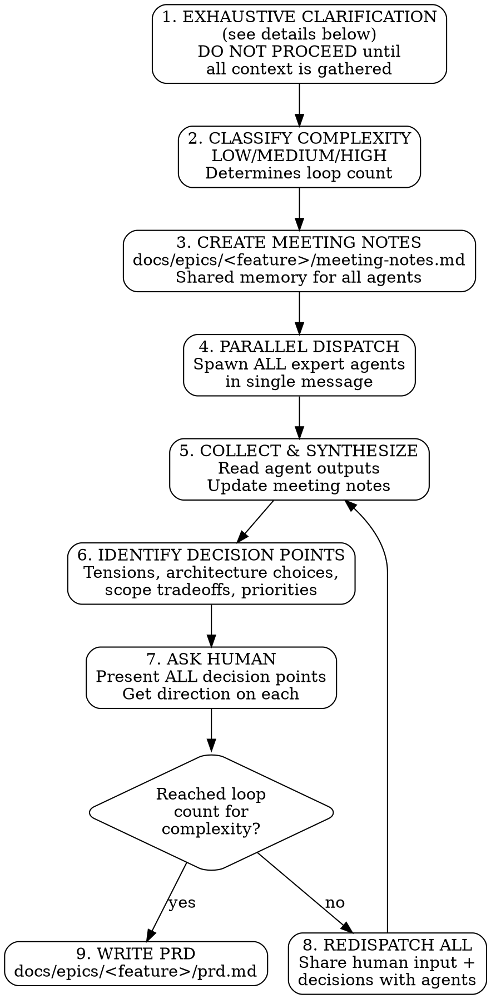

# Product Brainstorming With Team

## Overview

Multi-agent collaborative forum for feature research. Dispatches parallel expert agents, maintains shared meeting notes,
runs **complexity-based discussion loops** (LOW=3, MEDIUM=5, HIGH=7) with human input on **all decision points** (
tensions, architecture, scope, priorities).

**This is NOT single-agent brainstorming.** You MUST spawn actual subagents for each perspective.

**Who runs this skill:** Only the main thread (meeting owner) can execute this workflow. The main thread has access to
the Task tool for spawning subagents. If you are a subagent (dispatched by another agent), you do NOT have this
capability - report back to the main thread instead.

## The Process



## Step 1: Exhaustive Clarification (CRITICAL)

**DO NOT MAKE ASSUMPTIONS. Ask until you're 100% clear.**

Before dispatching ANY agents, you MUST gather complete context from the human. Incomplete understanding leads to wasted
agent cycles and wrong recommendations.

### Required Context Categories

| Category               | Questions to Ask                                                    |
|------------------------|---------------------------------------------------------------------|
| **What exists today?** | Current system? Tech stack? User base size? Known pain points?      |
| **Prior decisions**    | What's already been decided? What approaches were rejected and why? |
| **Scope boundaries**   | What's explicitly IN scope? What's OUT of scope?                    |
| **Success criteria**   | How will you know this succeeded? Metrics?                          |
| **Constraints**        | Budget? Timeline? Team skills? Compliance requirements?             |
| **Dependencies**       | What other systems/teams are involved? Blockers?                    |

### Clarification Rules

1. **Ask in rounds** - Don't ask 20 questions at once. Ask 3-5, get answers, ask follow-ups.
2. **Confirm understanding** - Summarize what you heard. "So to confirm: [X, Y, Z]. Correct?"
3. **Probe vague answers** - "Use existing backend" → Which services? What database? What auth exists today?
4. **No implicit assumptions** - If you're assuming something, ASK instead.

### Red Flags - You're Making Assumptions If:

- You're guessing which technologies/providers to consider
- You're imagining what the current system looks like
- You're assuming users have/don't have certain capabilities
- You're filling in blanks the human didn't specify
- You think "they probably mean X" without confirming

**STOP. Ask the human. Then proceed.**

### When to Move to Step 2

Only proceed to classify complexity when you can answer ALL of these:

- [ ] I know exactly what problem we're solving
- [ ] I know what exists today (not assumed)
- [ ] I know what's been tried/rejected before
- [ ] I know the explicit scope boundaries
- [ ] I have confirmed my understanding with the human

---

## Step 2: Classify Complexity (DETERMINES LOOP COUNT)

After clarification, classify the feature's complexity. This determines how many discussion loops you MUST run.

### Complexity Levels

| Level      | Loop Count | Criteria                                                                            |
|------------|------------|-------------------------------------------------------------------------------------|
| **LOW**    | 3 loops    | Single domain, clear requirements, minimal integrations, well-understood tech       |
| **MEDIUM** | 5 loops    | Cross-domain, some ambiguity, multiple integrations, new tech evaluation            |
| **HIGH**   | 7 loops    | Multi-system, novel domain, regulatory/compliance, significant architecture changes |

### Classification Checklist

**Mark as HIGH if ANY of these apply:**

- Involves regulatory/compliance requirements (GDPR, HIPAA, SOC2, etc.)
- Requires significant architecture changes
- Touches 3+ existing systems
- Involves AI/ML with novel use cases
- Has security-critical components (auth, payments, PII)
- Unclear competitive landscape requiring deep research

**Mark as MEDIUM if ANY of these apply (and not HIGH):**

- Crosses 2+ team boundaries
- Requires evaluating new technologies
- Has dependencies on external systems/APIs
- Involves user-facing changes affecting >10% of users
- Needs market research for positioning

**Mark as LOW only if:**

- Single domain, single team
- Well-understood requirements
- Standard tech stack
- Internal tooling or low-risk features

**When in doubt, classify UP.** Better to have more discussion than miss critical issues.

### Document Classification

In meeting notes, record:

```markdown
## Complexity Classification: [HIGH/MEDIUM/LOW]

**Reason:** [1-2 sentence justification]
**Required Loops:** [3/5/7]
```

---

## Expert Agents (MUST Dispatch All)

| Agent               | Model | Focus                                                                       | Required Tools                  |
|---------------------|-------|-----------------------------------------------------------------------------|---------------------------------|
| Product Manager     | opus  | Phases, MVP scope, roadmap fit                                              | -                               |
| Product Marketer    | opus  | Positioning, market fit, competition analysis                               | **MUST use WebSearch/WebFetch** |
| Principal Engineer  | opus  | Architecture, tech stack, scale                                             | -                               |
| Security Specialist | opus  | Vulnerability Assessment, Compliance, data protection, risks                | -                               |
| UI/UX Specialist    | opus  | Usability, adoption, accessibility                                          | -                               |
| Platform Engineer   | opus  | Deployment, maintenance, operations                                         | -                               |
| Researcher          | opus  | Technology developments, Case studies, Current best practices and standards | **MUST use WebSearch/WebFetch** |
| ML/AI Engineer      | opus  | Only if AI/ML is involved                                                   | -                               |

### Web Research Requirements (CRITICAL)

**Product Marketer and Researcher MUST use WebSearch and WebFetch tools.** Markets change daily. Static knowledge is
insufficient.

**Product Marketer must research:**

- Current competitor offerings and pricing
- Recent market trends and shifts
- Customer sentiment and reviews of competing products
- Industry analyst reports and forecasts

**Researcher must research:**

- Latest technology developments in the domain
- Recent case studies and implementations
- Current best practices and standards
- Emerging solutions and startups in the space

**In agent prompts, EXPLICITLY instruct:**

```
You MUST use WebSearch to research current market conditions.
Do NOT rely solely on training data - the landscape changes daily.
Include URLs and dates for all market claims.
```

**Red Flag:** If Product Marketer or Researcher output contains NO web citations, their analysis is stale. Redispatch
with explicit web research instructions.

## IRON Rules

**You MUST follow these rules. No exceptions.**

1. **EXHAUST clarification BEFORE dispatch** - No assumptions. Ask until 100% clear.
2. **CLASSIFY complexity and commit to loop count** - LOW=3, MEDIUM=5, HIGH=7. No shortcuts.
3. **ACTUALLY dispatch subagents** - Use Task tool with parallel calls in ONE message
4. **Create shared meeting notes file FIRST** - Agents read this for context
5. **Run the FULL loop count for complexity** - Not 1-2 fewer "because we covered it."
6. **Ask human on ALL decision points** - Not just tensions (MUST use AskUserQuestion tool)
7. **Product Marketer & Researcher MUST use WebSearch/WebFetch** - No stale market data.
8. **Update meeting notes after each round** - Shared memory must stay current

## Human Decision Points (CRITICAL - Not Just Tensions)

**Ask the human about ALL of these, not just tensions:**

| Decision Type            | When to Ask                    | Example                                                                |
|--------------------------|--------------------------------|------------------------------------------------------------------------|
| **Tensions**             | Experts disagree on approach   | "Engineer says build custom, Platform says use SaaS. Which direction?" |
| **Architecture Choices** | Multiple valid technical paths | "Microservices vs monolith? Event-driven vs REST?"                     |
| **Scope Tradeoffs**      | Feature vs timeline conflicts  | "Full feature takes 3 months, MVP takes 1. Which scope?"               |
| **Priority Conflicts**   | Multiple features competing    | "Security hardening vs new features first?"                            |
| **Resource Allocation**  | Team/budget decisions          | "Hire specialist or train existing team?"                              |
| **Build vs Buy**         | Make or purchase decision      | "Build auth system or use Auth0/Okta?"                                 |
| **Risk Tolerance**       | Uncertainty in approach        | "New tech is faster but unproven. Accept risk?"                        |
| **User Segmentation**    | Who to serve first             | "Enterprise or SMB first? Different UX needs."                         |

### Decision Point Collection Process

After each round, categorize ALL open questions:

```markdown
## Round N Decision Points

### Tensions (Expert Disagreements)

- [List conflicts between expert perspectives]

### Architecture Decisions Needed

- [List technical choices requiring human input]

### Scope/Priority Tradeoffs

- [List feature vs timeline/resource conflicts]

### Risk Decisions

- [List uncertain approaches needing risk tolerance input]
```

**Use AskUserQuestion for EACH category with options.** Don't batch all decisions into one question - group by type for
clarity.

## Red Flags - STOP and Fix

- **Making assumptions** about what exists, what's been tried, or what's in scope
- Planning to "simulate" or "represent" perspectives yourself
- Skipping subagent dispatch because "it's more efficient"
- Resolving tensions without asking the human
- **Only asking about tensions** - architecture choices, scope tradeoffs, etc. also need human input
- Stopping before reaching the loop count for your complexity level
- **Product Marketer or Researcher output has no web citations** - redispatch with explicit web instructions
- Forgetting to create/update meeting notes file
- Proceeding with vague answers like "use existing backend" without probing
- **Classifying as LOW to reduce loops** - when in doubt, classify UP

**All of these mean: You're violating the workflow. Fix it.**

## Parallel Dispatch Template

In a SINGLE message, dispatch ALL agents:

```
[Task tool: Product Manager agent]
[Task tool: Product Marketer agent]
[Task tool: Principal Engineer agent]
[Task tool: Security Specialist agent]
[Task tool: UI/UX Specialist agent]
[Task tool: Platform Engineer agent]
[Task tool: Researcher agent]
```

Each agent prompt MUST include:

1. The feature being explored
2. Path to meeting notes file to read
3. Their specific focus area
4. Request for 3-5 bullet points of concerns/ideas

## Meeting Notes Template

Create at `docs/epics/<feature>/meeting-notes.md`:

```markdown
# <Feature> - Meeting Notes

## Goal

[From clarification step]

## Audience

[From clarification step]

## Constraints

[From clarification step]

## Complexity Classification: [HIGH/MEDIUM/LOW]

**Reason:** [1-2 sentence justification]
**Required Loops:** [3/5/7]

---

## Round 1: Initial Perspectives

### Product Manager

[Agent output]

### Product Marketer

[Agent output]

### Principal Engineer

[Agent output]

### Security Specialist

[Agent output]

### UI/UX Specialist

[Agent output]

### Platform Engineer

[Agent output]

### Researcher

[Agent output]

## Round 1 Decision Points

### Tensions (Expert Disagreements)

- [Tension 1]
- [Tension 2]

### Architecture Decisions Needed

- [Decision 1]

### Scope/Priority Tradeoffs

- [Tradeoff 1]

### Risk Decisions

- [Risk 1]

## Human Input (Round 1)

[Record human's decisions for EACH category above]

---

## Round 2: Refined Perspectives

[Continue pattern for each round...]
```

## Output

After completing all loops for your complexity level, write PRD to `docs/epics/<feature>/prd.md`:

```markdown
# <Feature> - Product Requirements Document

## Executive Summary

[1-2 paragraphs]

## Goals & Success Metrics

[From discussion]

## User Stories

### Story 1: [Short Title]

**As a** [user type/persona],
**I want** [capability/feature],
**So that** [benefit/value].

**Acceptance Criteria:**

- [ ] Given [precondition], when [action], then [expected result]
- [ ] Given [precondition], when [action], then [expected result]
- [ ] [Edge case handling]
- [ ] [Error state handling]

**Priority:** [P0/P1/P2]
**Complexity:** [S/M/L/XL]

---

### Story 2: [Short Title]

**As a** [user type/persona],
**I want** [capability/feature],
**So that** [benefit/value].

**Acceptance Criteria:**

- [ ] Given [precondition], when [action], then [expected result]
- [ ] ...

**Priority:** [P0/P1/P2]
**Complexity:** [S/M/L/XL]

---

[Continue for all stories...]

## Technical Approach

[From Principal Engineer + Platform Engineer]

## Security & Compliance

[From Security Specialist]

## UX Requirements

[From UI/UX Specialist]

## Go-to-Market Considerations

[From Product Marketer - MUST include web research citations]

## Market Research Summary

[From Researcher - MUST include web research citations with URLs and dates]

## Phases

[From Product Manager]

## Open Questions

[Unresolved from discussion]

## Appendix: Meeting Notes

See meeting-notes.md for full discussion history.
```

### User Story Requirements (CRITICAL)

**Every user story MUST have:**

1. **User persona** - Who benefits? (admin, end user, developer, etc.)
2. **Capability** - What can they do?
3. **Value** - Why does it matter?
4. **Acceptance Criteria** - How do we know it's done?
  - Use Given/When/Then format
  - Include happy path AND edge cases
  - Include error states
5. **Priority** - P0 (must have), P1 (should have), P2 (nice to have)
6. **Complexity** - S (hours), M (days), L (week), XL (weeks)

**Red Flag:** If a PRD has vague user stories like "Users can login" without acceptance criteria, it's incomplete. Add
specific criteria before finalizing.

## Common Rationalizations (Don't Fall For These)

| Excuse                                        | Reality                                                                        |
|-----------------------------------------------|--------------------------------------------------------------------------------|
| "I can represent all perspectives myself"     | No. Different agents bring different reasoning. Dispatch them.                 |
| "Simulating is more efficient"                | Efficiency isn't the goal. Diverse perspectives are.                           |
| "One loop covered everything"                 | It didn't. Run your complexity's loop count. Insights emerge over iterations.  |
| "This is simple, LOW complexity"              | Did you check the criteria? When in doubt, classify UP.                        |
| "The tensions are obvious, no need to ask"    | Ask anyway. Human decides, not you.                                            |
| "Only tensions need human input"              | Wrong. Architecture choices, scope tradeoffs, priorities ALL need human input. |
| "My training data has market info"            | Markets change daily. Product Marketer and Researcher MUST use WebSearch.      |
| "Web research is optional"                    | No. If no web citations, the analysis is stale. Redispatch.                    |
| "Meeting notes file is overhead"              | It's required shared memory. Create it.                                        |
| "I don't have the Task tool"                  | You might be a subagent. Only main thread runs this skill. Report back.        |
| "I have enough context to start"              | Do you? Review the checklist. Can you answer ALL items without guessing?       |
| "The user gave me the basics"                 | Basics aren't enough. Probe deeper. What exists today? What's been tried?      |
| "I'll clarify as tensions emerge"             | Too late. Agents will waste cycles on wrong assumptions. Clarify NOW.          |
| "Asking too many questions is annoying"       | Wasting time on wrong direction is worse. Ask until clear.                     |
| "User stories don't need acceptance criteria" | Yes they do. Without criteria, how do you know it's done? Add them.            |
